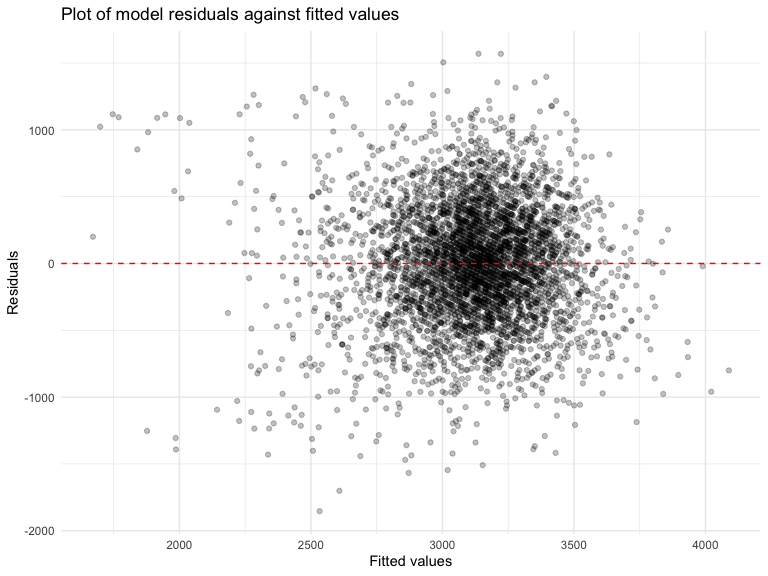

Homework 6 Linear Models
================
Minghui Wang
2024-12-02

This assignment reinforces ideas in [Linear
Models](https://p8105.com/topic_linear_models.html).

Load key packages:

``` r
library(tidyverse)
library(ggplot2)
library(modelr)
library(mgcv)
library(purrr)
knitr::opts_chunk$set(
    echo = TRUE,
    warning = FALSE,
    fig.width = 8, 
  fig.height = 6,
  out.width = "90%"
)

theme_set(theme_minimal() + theme(legend.position = "bottom"))

options(
  ggplot2.continuous.colour = "viridis",
  ggplot2.continuous.fill = "viridis"
)

scale_colour_discrete = scale_colour_viridis_d
scale_fill_discrete = scale_fill_viridis_d

set.seed(1)
```

# Problem 2

Create a city_state variable (e.g. “Baltimore, MD”), and a binary
variable indicating whether the homicide is solved. Omit cities Dallas,
TX; Phoenix, AZ; and Kansas City, MO – these don’t report victim race.
Also omit Tulsa, AL – this is a data entry mistake. For this problem,
limit your analysis those for whom victim_race is white or black. Be
sure that victim_age is numeric.

``` r
homicide_data <- read.csv("https://raw.githubusercontent.com/washingtonpost/data-homicides/refs/heads/master/homicide-data.csv")|>
  mutate(
    city_state = paste(city, state, sep = ", "),
    resolved = as.numeric(disposition == "Closed by arrest"),
    victim_age = as.numeric(victim_age)
    ) |> 
  filter(
    !city_state %in% c("Dallas, TX", "Phoenix, AZ", "Kansas City, MO", "Tulsa, AL") &
    victim_race %in% c("White", "Black") 
    ) |> 
  drop_na(victim_age) |> view()
```

For the city of Baltimore, MD, use the glm function to fit a logistic
regression with resolved vs unresolved as the outcome and victim age,
sex and race as predictors:

- save the output of glm as an R object;
- apply the broom::tidy to this object;

``` r
fit_md_logistic = homicide_data |>
  filter(city_state == "Baltimore, MD") |>
  glm(resolved ~ victim_age + victim_sex + victim_race, data = _, family = binomial()) 
  
fit_md_logistic|>
  broom::tidy()|> 
  knitr::kable(digits = 3)
```

| term             | estimate | std.error | statistic | p.value |
|:-----------------|---------:|----------:|----------:|--------:|
| (Intercept)      |    0.310 |     0.171 |     1.810 |   0.070 |
| victim_age       |   -0.007 |     0.003 |    -2.024 |   0.043 |
| victim_sexMale   |   -0.854 |     0.138 |    -6.184 |   0.000 |
| victim_raceWhite |    0.842 |     0.175 |     4.818 |   0.000 |

- obtain the estimate and confidence interval of the adjusted odds ratio
  for solving homicides comparing male victims to female victims keeping
  all other variables fixed.

``` r
fit_md_logistic|>
  broom::tidy(conf.int = TRUE)|> 
  mutate(
    OR = exp(estimate),           
    OR_conf.low = exp(conf.low), 
    OR_conf.high = exp(conf.high)
  )|>
  filter(term == "victim_sexMale") |>
  select(term, OR, OR_conf.low, OR_conf.high) |>
  knitr::kable(digits = 3)
```

| term           |    OR | OR_conf.low | OR_conf.high |
|:---------------|------:|------------:|-------------:|
| victim_sexMale | 0.426 |       0.324 |        0.558 |

**Intepretation**: The adjusted odds ratio (OR) for solving homicides
comparing male victims to female victims, keeping all other variables
fixed (age and race), is 0.426. This indicates that the odds of solving
homicides for male victims are approximately 57.4% lower compared to
female victims, holding age and race constant. The 95% confidence
interval for the OR is between 32.4% and 55.8%, which means we are 95%
confident that the true odds ratio lies between 32.4% and 55.8%. This
provides strong evidence that male victims are less likely to have their
homicides solved compared to female victims, when other factors are
controlled.

Run glm for each of the cities in your dataset, and extract the adjusted
odds ratio (and CI) for solving homicides comparing male victims to
female victims. Do this within a “tidy” pipeline, making use of
purrr::map, list columns, and unnest as necessary to create a dataframe
with estimated ORs and CIs for each city.

``` r
cities_glm_or_sex = homicide_data |>
  group_by(city_state) |>
  nest(data = -city_state) |>
  mutate(
    models = map(data, \(df) glm(resolved ~ victim_age + victim_sex + victim_race, data = df, family = binomial()) ),
    results = map(models, \(df) broom::tidy(df, conf.int = TRUE, exponentiate = TRUE))) |> 
  select(-data, -models) |> 
  unnest(results)|>
  filter(term == "victim_sexMale")|>
  select(city_state, term, OR=estimate, CI_lower = conf.low, CI_upper = conf.high)

cities_glm_or_sex|>
  knitr::kable(digits = 3)
```

| city_state         | term           |    OR | CI_lower | CI_upper |
|:-------------------|:---------------|------:|---------:|---------:|
| Albuquerque, NM    | victim_sexMale | 1.767 |    0.825 |    3.762 |
| Atlanta, GA        | victim_sexMale | 1.000 |    0.680 |    1.458 |
| Baltimore, MD      | victim_sexMale | 0.426 |    0.324 |    0.558 |
| Baton Rouge, LA    | victim_sexMale | 0.381 |    0.204 |    0.684 |
| Birmingham, AL     | victim_sexMale | 0.870 |    0.571 |    1.314 |
| Boston, MA         | victim_sexMale | 0.674 |    0.353 |    1.277 |
| Buffalo, NY        | victim_sexMale | 0.521 |    0.288 |    0.936 |
| Charlotte, NC      | victim_sexMale | 0.884 |    0.551 |    1.391 |
| Chicago, IL        | victim_sexMale | 0.410 |    0.336 |    0.501 |
| Cincinnati, OH     | victim_sexMale | 0.400 |    0.231 |    0.667 |
| Columbus, OH       | victim_sexMale | 0.532 |    0.377 |    0.748 |
| Denver, CO         | victim_sexMale | 0.479 |    0.233 |    0.962 |
| Detroit, MI        | victim_sexMale | 0.582 |    0.462 |    0.734 |
| Durham, NC         | victim_sexMale | 0.812 |    0.382 |    1.658 |
| Fort Worth, TX     | victim_sexMale | 0.669 |    0.394 |    1.121 |
| Fresno, CA         | victim_sexMale | 1.335 |    0.567 |    3.048 |
| Houston, TX        | victim_sexMale | 0.711 |    0.557 |    0.906 |
| Indianapolis, IN   | victim_sexMale | 0.919 |    0.678 |    1.241 |
| Jacksonville, FL   | victim_sexMale | 0.720 |    0.536 |    0.965 |
| Las Vegas, NV      | victim_sexMale | 0.837 |    0.606 |    1.151 |
| Long Beach, CA     | victim_sexMale | 0.410 |    0.143 |    1.024 |
| Los Angeles, CA    | victim_sexMale | 0.662 |    0.457 |    0.954 |
| Louisville, KY     | victim_sexMale | 0.491 |    0.301 |    0.784 |
| Memphis, TN        | victim_sexMale | 0.723 |    0.526 |    0.984 |
| Miami, FL          | victim_sexMale | 0.515 |    0.304 |    0.873 |
| Milwaukee, wI      | victim_sexMale | 0.727 |    0.495 |    1.054 |
| Minneapolis, MN    | victim_sexMale | 0.947 |    0.476 |    1.881 |
| Nashville, TN      | victim_sexMale | 1.034 |    0.681 |    1.556 |
| New Orleans, LA    | victim_sexMale | 0.585 |    0.422 |    0.812 |
| New York, NY       | victim_sexMale | 0.262 |    0.133 |    0.485 |
| Oakland, CA        | victim_sexMale | 0.563 |    0.364 |    0.867 |
| Oklahoma City, OK  | victim_sexMale | 0.974 |    0.623 |    1.520 |
| Omaha, NE          | victim_sexMale | 0.382 |    0.199 |    0.711 |
| Philadelphia, PA   | victim_sexMale | 0.496 |    0.376 |    0.650 |
| Pittsburgh, PA     | victim_sexMale | 0.431 |    0.263 |    0.696 |
| Richmond, VA       | victim_sexMale | 1.006 |    0.483 |    1.994 |
| San Antonio, TX    | victim_sexMale | 0.705 |    0.393 |    1.238 |
| Sacramento, CA     | victim_sexMale | 0.669 |    0.326 |    1.314 |
| Savannah, GA       | victim_sexMale | 0.867 |    0.419 |    1.780 |
| San Bernardino, CA | victim_sexMale | 0.500 |    0.166 |    1.462 |
| San Diego, CA      | victim_sexMale | 0.413 |    0.191 |    0.830 |
| San Francisco, CA  | victim_sexMale | 0.608 |    0.312 |    1.155 |
| St. Louis, MO      | victim_sexMale | 0.703 |    0.530 |    0.932 |
| Stockton, CA       | victim_sexMale | 1.352 |    0.626 |    2.994 |
| Tampa, FL          | victim_sexMale | 0.808 |    0.340 |    1.860 |
| Tulsa, OK          | victim_sexMale | 0.976 |    0.609 |    1.544 |
| Washington, DC     | victim_sexMale | 0.690 |    0.465 |    1.012 |

Create a plot that shows the estimated ORs and CIs for each city.
Organize cities according to estimated OR, and comment on the plot.

``` r
cities_glm_or_sex |>
  ungroup()|>
  mutate(city_state = fct_reorder(city_state, OR)) |> 
  ggplot(aes(x = OR, y = city_state)) +
  geom_point(color = "blue") +
  geom_errorbarh(aes(xmin = CI_lower, xmax = CI_upper), height = 0.2, color = "black") +  
  labs(
    title = "Adjusted Odds Ratios for Solving Homicides Male vs Female Victims",
    x = "Adjusted Odds Ratio",
    y = "Cities",
    caption = "Error bars represent 95% confidence intervals.\n'Female' is the reference group"
  ) +
  theme_minimal()+  
  theme(
    plot.caption = element_text(hjust = 0)
  )
```


**Conclusion**:The plot shows OR in solving homicides comaring male to
female victims in different cities. In most cities, male victims are
less likely to have their cases solved, shown by odds ratios below 1.
Cities like New York, NY, and Baton Rouge, LA have much lower odds for
male victims. A few cities, like Albuquerque, NM, and Stockton, CA, show
the opposite, where male victims are more likely to have their cases
solved. Some cities, like Atlanta, and Richmond have odds ratios close
to 1, meaning there is little difference between male and female
victims. The confidence intervals vary, with cities like Chicago,
showing more precise results, while cities like Albuquerque, NM, have
larger uncertainty.

# Problem 3

3.1 Load and clean the data for regression analysis (i.e. convert
numeric to factor where appropriate, check for missing data, etc.)

``` r
birthweight = read.csv("data/birthweight.csv", na = c("NA","",".")) |>
  drop_na()|>
  mutate(
    babysex = factor(babysex, levels = c(1, 2), labels = c("Male", "Female")),
    malform = factor(malform, levels = c(0, 1), labels = c("Absent", "Present")),
    frace = factor(frace, levels = c(1, 2, 3, 4, 8, 9), labels = c("White", "Black", "Asian", "Puerto Rican", "Other", "Unknown")),
    mrace = factor(mrace, levels = c(1, 2, 3, 4, 8), labels = c("White", "Black", "Asian", "Puerto Rican", "Other"))
  )
```

After checking, there is no missing data in this dataset.

3.2 Propose a regression model for birthweight. This model may be based
on a hypothesized structure for the factors that underly birthweight, on
a data-driven model-building process, or a combination of the two.

Step 1: Start with a Hypothesized Model Structure Based on the prior
knowledge, the birthweight is influenced by factors such as : -
`babysex`: baby’s sex (male = 1, female = 2) - `gaweeks`: gestational
age in weeks - `malform`: presence of malformations that could affect
weight (0 = absent, 1 = present) - `momage`: mother’s age at delivery
(years) - `smoken`: average number of cigarettes smoked per day during
pregnancy - `wtgain`: mother’s weight gain during pregnancy (pounds) -
`fincome`: family monthly income (in hundreds, rounded)

Step 2: Fit the linear regression model

``` r
fit_bw_0 = birthweight |>
  lm(bwt ~ babysex + gaweeks + malform + momage + smoken + wtgain + fincome , data = _)
```

``` r
fit_bw_0 |> 
  broom::glance() |> 
  knitr::kable(digits = 3)
```

| r.squared | adj.r.squared |   sigma | statistic | p.value |  df |    logLik |      AIC |      BIC |  deviance | df.residual | nobs |
|----------:|--------------:|--------:|----------:|--------:|----:|----------:|---------:|---------:|----------:|------------:|-----:|
|     0.244 |         0.243 | 445.644 |   199.921 |       0 |   7 | -32641.14 | 65300.28 | 65357.67 | 860724457 |        4334 | 4342 |

``` r
fit_bw_0 |> 
  broom::tidy()|> 
  knitr::kable(digits = 3)
```

| term           | estimate | std.error | statistic | p.value |
|:---------------|---------:|----------:|----------:|--------:|
| (Intercept)    |  311.514 |    89.181 |     3.493 |   0.000 |
| babysexFemale  |  -87.541 |    13.562 |    -6.455 |   0.000 |
| gaweeks        |   59.715 |     2.194 |    27.219 |   0.000 |
| malformPresent |  -15.049 |   115.434 |    -0.130 |   0.896 |
| momage         |   11.283 |     1.864 |     6.054 |   0.000 |
| smoken         |   -7.660 |     0.919 |    -8.339 |   0.000 |
| wtgain         |    9.465 |     0.630 |    15.032 |   0.000 |
| fincome        |    1.926 |     0.276 |     6.967 |   0.000 |

**Describe modeling process**: The modeling process for birthweight
(bwt) began by hypothesizing key factors that influence birthweight
based on prior knowledge, including gestational age (gaweeks), maternal
smoking (smoken), maternal weight gain during pregnancy (wtgain), family
income (fincome), presence of malformations (malform), baby’s sex
(babysex), and mother’s age at delivery (momage). A linear regression
model was chosen to quantify the relationships between these predictors
and birthweight. The dataset was examined to ensure all variables were
properly formatted, with categorical variables (e.g., babysex and
malform) treated appropriately. Quadratic terms or interactions were not
initially included

Step3: Show a plot of model residuals against fitted values – use
add_predictions and add_residuals in making this plot.

``` r
birthweight |>
  modelr::add_residuals(fit_bw_0, var = "model_0_residuals")|>
  modelr::add_predictions(fit_bw_0, var = "model_0_fitted_values")|>
  ggplot(aes(x = model_0_fitted_values, y = model_0_residuals))+
  geom_point(alpha = 0.25) + 
  geom_hline(yintercept = 0, linetype = "dashed", color = "red") +
  labs(
    title = "Plot of model residuals against fitted values",
    x = "Fitted values",
    y = "Residuals"
  ) +
  theme_minimal()
```



The residual plot shows that most of the residuals are spread around the
zero line (red dashed line), which means the linearity assumption of the
model is mostly fine. However, the residuals seem to spread more at the
lower and higher fitted values (e.g., below 2000 and above 4000), which
suggests the model’s variance might not be constant. There is no clear
pattern, but some large residuals might mean that the model is missing
important predictors or nonlinear relationships.

3.3 Compare your model to two others:

- One using length at birth and gestational age as predictors (main
  effects only)
- One using head circumference, length, sex, and all interactions
  (including the three-way interaction) between these

``` r
fit_bw_1 = birthweight |>
  lm(bwt ~ blength +  gaweeks , data = _)
fit_bw_2 = birthweight  |>
  lm(bwt ~ bhead  + blength + babysex  , data = _)
```

Make this comparison in terms of the cross-validated prediction error;
use crossv_mc and functions in purrr as appropriate.
